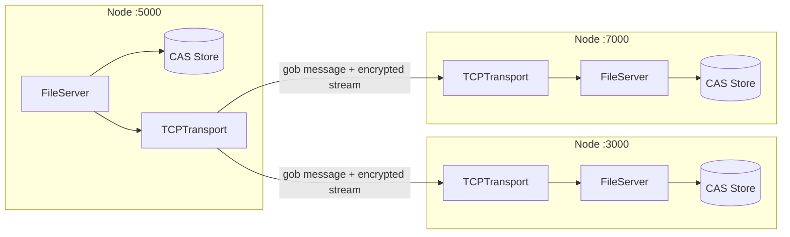

# DFSS — Distributed File Storage System

A peer-to-peer, content-addressable file store in Go. Files are encrypted with AES-CTR and replicated across nodes over a custom TCP transport.




## Overview

DFSS is a learning project in distributed systems. Each node runs a file server with its own on-disk store. When a node stores a file, it broadcasts the file to its peers. When it is asked for a file it does not have, it fetches the file from the network. The design follows Anthony GG's *foreverstore* series (the Go module path still reads `github.com/anthdm/foreverstore`). This repo reimplements that design and extends it with an HTTP upload/download layer and a standalone client.

## Key features

- **Peer-to-peer replication.** `Store` writes locally, then streams the file to every connected peer.
- **Network fallback on read.** `Get` serves from local disk if possible. Otherwise it broadcasts a request, receives the file, and decrypts it into the local store.
- **Content-addressable storage.** Keys are SHA-1 hashed and split into a nested directory path (e.g. `68044/29f74/.../353ff`).
- **Encryption.** File contents are encrypted with AES-256-CTR before they leave the node, with a random IV prepended to the stream.
- **Pluggable transport.** `Transport` and `Peer` interfaces, with TCP as the implementation and swappable handshake and decoder functions.
- **Bootstrap nodes.** On startup a node dials its list of bootstrap peers concurrently.
- **HTTP API (in progress).** `/upload` (multipart POST) and `/download?key=` handlers, plus a Go client in `client.go`.

## Tech stack

- **Go**, standard library only at runtime: `net`, `encoding/gob`, `encoding/binary`, `crypto/aes`, `crypto/cipher`, `sync`, `net/http`
- **testify** for tests
- **Make** for build, run, and test

## Technical highlights

- **Message and stream multiplexing over one TCP connection.** Every frame begins with a control byte: `IncomingMessage` (0x1) or `IncomingStream` (0x2). Messages are gob-decoded and passed to the server loop through a buffered channel. A stream byte pauses the peer's read loop on a `sync.WaitGroup` until the server has consumed exactly the bytes it expects and calls `CloseStream()`. This lets raw file bytes share the socket with control messages without being misread.
- **Length-prefixed transfers.** The sender writes the file size as a little-endian `int64` first, and the receiver reads through `io.LimitReader`. A reader therefore never blocks waiting for an EOF that will not arrive on a long-lived connection.
- **Streaming I/O.** `io.TeeReader` lets the node write to disk and buffer for replication in a single pass. `io.MultiWriter` fans the encrypted stream out to all peers. Encryption runs as a 32 KB streaming XOR, so files are never loaded fully into memory for crypto.
- **Typed, extensible protocol.** `Message{Payload any}` uses gob-registered payload types (`MessageStoreFile`, `MessageGetFile`), and a type switch dispatches them.
- **Isolation per node.** Each node has a random 32-byte ID and its own storage root. Files are namespaced by node ID on disk, and keys are MD5-hashed on the wire.
- **Concurrency.** There is one goroutine per connection, an accept loop, and a `select`-based event loop with a quit channel. A mutex guards the peer map.
- **Tests** cover the CAS path transform, store write/read/delete round-trips, and encrypt/decrypt symmetry.

## Getting started

### Prerequisites

- Go 1.18 or newer
- `make` (optional)

### Run

```bash
make build    # go build -o bin/dfss
make run      # build + run the 3-node demo
make test     # go test ./...
```

`main.go` starts three nodes on `:3000`, `:7000`, and `:5000`. The third node bootstraps to the first two. The demo then stores 20 files through the third node, deletes each one locally, and reads it back from the network, which exercises replication and remote fetch end to end.

### Status

The HTTP layer and client were the latest additions and still need work. Before the package builds cleanly, `client.go` needs its own `package main` directory (it declares a second `main`) and the HTTP server needs a port separate from the TCP transport.

## Project structure

```
DFSS/
├── main.go          # Node factory + 3-node demo
├── server.go        # FileServer: replication, remote fetch, message handling, HTTP handlers
├── store.go         # Content-addressable on-disk store
├── crypto.go        # AES-CTR stream encrypt/decrypt, IDs, key hashing
├── client.go        # HTTP upload/download client (WIP)
├── p2p/
│   ├── transport.go     # Transport / Peer interfaces
│   ├── tcp_transport.go # TCP implementation, read loop, stream gating
│   ├── encoding.go      # Frame decoder (message vs. stream)
│   ├── message.go       # RPC type and control bytes
│   └── handshake.go     # Pluggable handshake hook
├── *_test.go
└── Makefile
```

## Acknowledgements

The architecture is based on Anthony GG's [foreverstore](https://github.com/anthdm/foreverstore) tutorial series.

## Author

Lazar Gošić — GitHub [@lakygosh](https://github.com/lakygosh)
